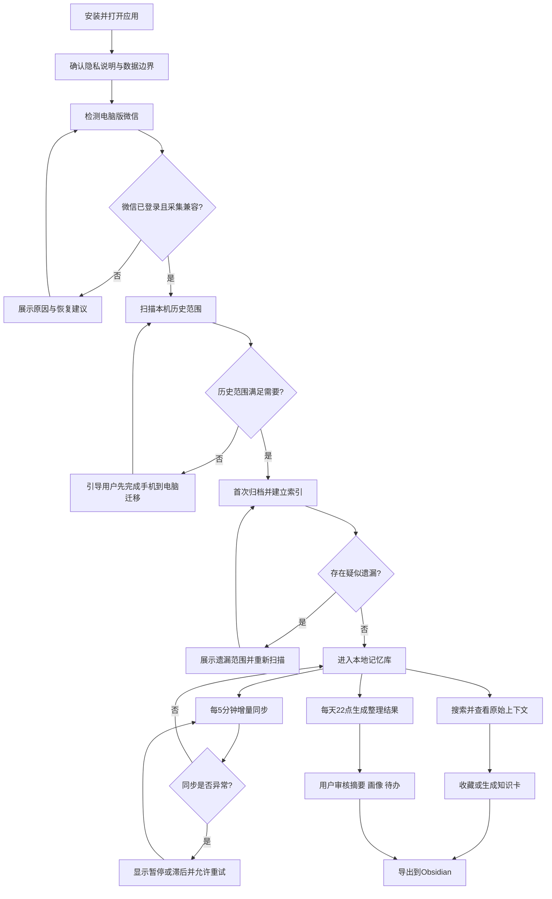
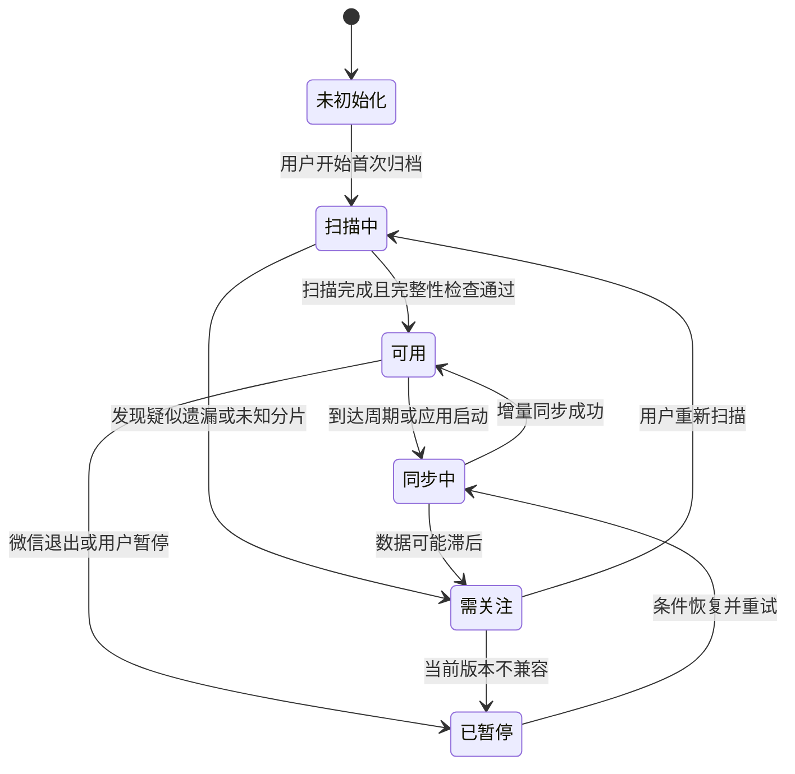
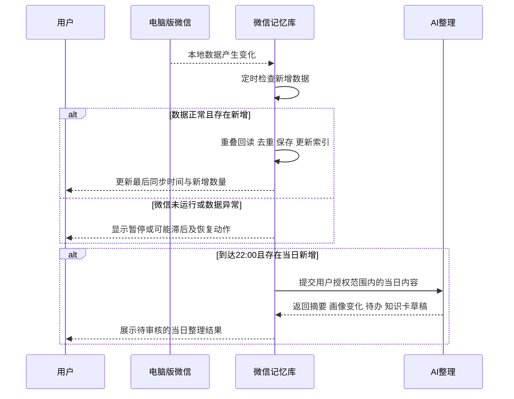

# 产品需求文档：本地微信沟通记忆库 MVP - V1.0

> 项目代号：wechatagent  
> 文档版本：PRD-001  
> 状态：进入 UI Demo 与技术 PoC  
> 日期：2026-07-22

## 1. 综述 (Overview)

### 1.1 项目背景与核心问题

微信重度办公用户长期处于群多、联系人多、资料分散的状态。微信原生搜索依赖用户记得关键词和会话位置，难以回答“谁在什么时候提过某件事”“这个客户有哪些需求和顾虑”“今天哪些群消息值得处理”等跨会话问题；换机、清理或附件过期也会使重要沟通难以追溯。

本项目建设一个 Windows 本地优先的个人微信沟通记忆库。产品归档用户本人电脑端微信已经同步到本机的数据，形成可搜索、可追溯、可编辑、可导出的长期知识资产。首版价值重点不是简单备份，而是把聊天记录转化为原文搜索、每日摘要、客户事实卡、待办、决策和 Obsidian 知识卡。

已确认的产品边界：

- 数据采集不依赖手动逐条导入；首次读取电脑端已有数据，之后自动增量收集。
- 默认每 5 分钟增量同步一次；应用启动时立即补同步；每天 22:00 生成当日整理结果。
- 产品只承诺处理电脑端微信已同步到本机的数据，不承诺获取手机端每一条消息。
- 个人微信没有稳定的官方全量历史 API；采集能力是可替换适配器，微信升级可能导致暂时不兼容。
- AI 结论必须能回到原始消息、发送人、时间、会话与前后文。
- 首版不包含代用户登录微信、读取他人设备、自动营销群发、云端集中保存全部聊天或企业团队 CRM。

### 1.2 核心业务流程 / 用户旅程地图

1. **安装与隐私确认** - 用户了解数据边界和处理方式，进入本地应用。
2. **微信数据源检测** - 系统检测电脑版微信登录状态、数据范围及采集兼容性。
3. **首次历史归档** - 用户确认范围，系统扫描、去重并建立历史索引。
4. **自动增量同步** - 系统启动时补同步，运行期间每 5 分钟读取新增数据并展示新鲜度。
5. **搜索与原文追溯** - 用户通过自然语言或条件搜索跨会话信息，并查看原始上下文。
6. **智能整理与行动** - 系统每天 22:00 生成群摘要、客户变化、待办、决策和知识卡草稿。
7. **审核、沉淀与导出** - 用户修订 AI 结果，将重要内容保存并导出到 Obsidian。
8. **数据与系统管理** - 用户管理关注范围、本地存储、AI 模式、备份、重建索引与删除。

### 1.3 Mermaid 图（流程/状态/时序）

#### 1.3.1 用户操作流



#### 1.3.2 同步任务状态机



#### 1.3.3 增量同步与每日整理时序



## 2. 用户故事详述 (User Stories)

### 阶段一：安装与隐私确认

---

#### **US-01: 作为微信重度办公用户，我希望在首次打开时了解数据处理边界，以便决定是否安全启用本地记忆库。**

* **价值陈述 (Value Statement)**:
  * **作为** 使用个人微信处理客户、项目和课程信息的用户
  * **我希望** 明确知道系统读取什么、保存在哪里、AI 是否联网
  * **以便于** 在知情的情况下启用产品并控制隐私风险
* **业务规则与逻辑 (Business Logic)**:
  1. **前置条件**: 用户首次启动应用；产品运行在 Windows 当前用户会话。
  2. **操作流程 (Happy Path)**:
     1. 展示产品用途、数据范围与“仅处理本人电脑端微信已同步数据”的说明。
     2. 告知个人微信采集能力可能随微信版本变化，产品不能保证手机端全量覆盖。
     3. 用户选择 AI 模式：纯本地，或允许指定内容调用云端模型。MVP 默认纯本地。
     4. 用户勾选确认并点击“开始检测微信”。
  3. **异常处理 (Error Handling)**:
     * 未勾选确认时，不允许进入数据检测。
     * 用户选择云端 AI 时，必须额外展示“哪些内容可能离开本机”，未经确认不得启用。
     * 用户取消时退出引导，不启动采集器、不创建消息索引。
  4. **边界约束**: 不要求用户提供微信密码，不代替用户登录，不上传原始聊天作为默认行为。
* **验收标准 (Acceptance Criteria)**:
  * **场景1: 纯本地模式启用成功**
    * **GIVEN** 用户首次打开应用并阅读隐私说明
    * **WHEN** 用户选择纯本地模式、勾选确认并继续
    * **THEN** 系统保存选择并进入微信检测页，不向外部服务发送聊天内容
  * **场景2: 未确认隐私说明**
    * **GIVEN** 用户未勾选确认项
    * **WHEN** 用户尝试继续
    * **THEN** 系统保持当前页面并提示“请先确认数据处理范围”

* **页面布局线框图 (ASCII Wireframe)**:

```text
+--------------------------------------------------------------------------------+
| 微信记忆库                                                        1 / 3 首次设置 |
+--------------------------------------------------------------------------------+
| 让重要沟通不再淹没在聊天里                                                     |
|                                                                                |
| 本应用将读取：电脑端微信已经同步到本机的聊天数据                               |
| 本应用不会：索取微信密码、代登录、承诺获取手机端全部消息                       |
|                                                                                |
| AI处理方式                                                                     |
| (•) 纯本地处理（推荐）                                                         |
| ( ) 使用云端AI  [查看可能发送的数据范围]                                       |
|                                                                                |
| [ ] 我已了解数据范围、版本兼容风险和本地存储位置                               |
|                                                     [退出] [开始检测微信 →]    |
+--------------------------------------------------------------------------------+
```

---

### 阶段二：微信数据源检测

#### **US-02: 作为用户，我希望系统自动检测电脑版微信与采集兼容性，以便知道是否可以开始归档。**

* **价值陈述 (Value Statement)**:
  * **作为** 非技术用户
  * **我希望** 一眼看懂微信是否已登录、数据是否可读和下一步怎么做
  * **以便于** 不接触密钥、数据库或命令行也能完成配置
* **业务规则与逻辑 (Business Logic)**:
  1. **前置条件**: 用户已完成 US-01。
  2. **操作流程 (Happy Path)**:
     1. 系统检测电脑版微信进程、当前账号、本地数据目录和采集适配器状态。
     2. 分别展示“微信登录”“本地数据”“采集兼容性”三项检查结果。
     3. 三项通过后激活“扫描历史范围”。
  3. **异常处理 (Error Handling)**:
     * 微信未运行：提示打开并登录电脑版微信，提供“重新检测”。
     * 无本地数据：提示先让微信完成同步；不宣称数据已经丢失。
     * 当前版本不兼容：显示检测到的版本、已归档数据仍可用及“等待适配更新”。
     * 账号变化：不得把不同微信账号数据合并；要求创建独立数据空间或切回原账号。
* **验收标准 (Acceptance Criteria)**:
  * **场景1: 检测全部通过**
    * **GIVEN** 电脑版微信已登录且采集适配器兼容
    * **WHEN** 用户进入检测页
    * **THEN** 三项检查显示通过并允许扫描历史范围
  * **场景2: 微信版本不兼容**
    * **GIVEN** 当前微信版本无法被采集适配器读取
    * **WHEN** 系统完成检测
    * **THEN** 页面显示“不兼容，新增同步已暂停”，且用户仍可进入已有记忆库

* **页面布局线框图 (ASCII Wireframe)**:

```text
+--------------------------------------------------------------------------------+
| 连接电脑版微信                                                    2 / 3 首次设置 |
+--------------------------------------------------------------------------------+
| 检测项目                         状态                         操作               |
| 微信登录                         ● 已登录：当前账号            [重新检测]        |
| 本地数据                         ● 已发现：约 18.6 GB          [查看范围]        |
| 采集兼容性                       ● 当前版本可用                [技术说明]        |
|--------------------------------------------------------------------------------|
| 数据只会复制到本地记忆库；不会修改微信中的原始记录。                           |
|                                              [返回] [扫描历史范围 →]           |
+--------------------------------------------------------------------------------+
```

---

### 阶段三：首次历史归档

#### **US-03: 作为用户，我希望查看并归档电脑上的历史范围，以便建立第一份可搜索的长期记忆库。**

* **价值陈述 (Value Statement)**:
  * **作为** 有多年微信历史的用户
  * **我希望** 清楚看到能归档多少会话、消息和附件元数据
  * **以便于** 判断是否需要先从手机迁移更多历史，并掌握归档完整性
* **业务规则与逻辑 (Business Logic)**:
  1. **前置条件**: US-02 检测通过；读取操作保持只读。
  2. **操作流程 (Happy Path)**:
     1. 系统扫描会话数量、最早/最晚消息时间、消息类型与预计索引时间。
     2. 用户选择“全部会话”或指定会话范围；默认全部会话。
     3. 用户点击“开始归档”，页面持续显示已处理消息数、当前阶段和预计剩余时间。
     4. 原始消息先入库；全文索引随后完成；向量与 AI 任务可在后台继续。
     5. 完成后展示覆盖报告和可能遗漏项。
  3. **异常处理 (Error Handling)**:
     * 历史范围不足：引导用户使用微信官方迁移能力将手机历史迁移到电脑，然后重新扫描。
     * 中途退出或断电：下次从检查点继续，不重复写入已完成消息。
     * 遇到无法解析的消息类型：保留原始类型与时间，标为“暂不支持解析”，不阻塞其余归档。
     * 发现未知数据库分片或源库时间领先：状态为“需关注”，禁止显示“全部完成”。
  4. **性能与容量提示**: 首次归档可能耗时较长；搜索可在全文索引完成后先行开放，AI索引可继续后台运行。
* **验收标准 (Acceptance Criteria)**:
  * **场景1: 首次归档成功**
    * **GIVEN** 系统发现可读历史数据
    * **WHEN** 用户选择全部会话并开始归档
    * **THEN** 系统完成原始入库、显示覆盖报告，并记录同步水位
  * **场景2: 归档中断后恢复**
    * **GIVEN** 归档进度达到40%时应用异常退出
    * **WHEN** 用户重新启动并选择继续
    * **THEN** 系统从最近检查点恢复且不产生重复消息

* **页面布局线框图 (ASCII Wireframe)**:

```text
+--------------------------------------------------------------------------------+
| 首次归档                                                             扫描中... |
+--------------------------------------------------------------------------------+
| 已发现：326 个会话 · 1,284,620 条消息 · 2020-03-12 至 2026-07-22              |
|                                                                                |
| [███████████████████████████---------------------] 58%                         |
| 正在处理：项目交流群 · 已保存 744,219 条 · 预计剩余 18 分钟                   |
|                                                                                |
| 阶段      原始消息入库 ✓     全文索引 进行中     AI索引 等待中                |
|                                                                                |
| 提示：关闭应用后可在下次启动时继续。                                           |
|                                                         [暂停] [后台运行]      |
+--------------------------------------------------------------------------------+
```

---

### 阶段四：自动增量同步

#### **US-04: 作为用户，我希望系统自动收集新增聊天并清楚显示同步状态，以便无需每天手动整理。**

* **价值陈述 (Value Statement)**:
  * **作为** 每天产生大量新聊天的用户
  * **我希望** 新消息自动进入记忆库，异常时得到明确提醒
  * **以便于** 长期维护资料而不承担重复导入成本
* **业务规则与逻辑 (Business Logic)**:
  1. **前置条件**: 首次归档已建立同步水位。
  2. **操作流程 (Happy Path)**:
     1. 应用启动后立即执行一次补同步。
     2. 运行期间默认每 5 分钟检查源数据变化、新分片及最新消息时间。
     3. 每次从上次水位附近重叠回读一小段范围，以覆盖延迟写入；以稳定消息标识去重。
     4. 新增消息先保存原文与元数据，再异步更新全文索引、语义索引和画像统计。
     5. 首页持续显示最后成功同步时间、新增数量和数据新鲜度。
  3. **异常处理 (Error Handling)**:
     * 微信退出或电脑离线：状态变为“已暂停”，恢复后自动补同步。
     * 应用退出：重启后从水位补拉，不要求应用永久运行。
     * 数据源最新时间领先但消息未读到：标为“可能滞后”，扩大回读范围并允许用户重试。
     * 当前微信版本不兼容：停止读取新数据，保留既有数据和搜索能力。
  4. **明确承诺**: 自动归档电脑端微信已同步到本机的数据，不保证手机端所有消息都已到达电脑。
* **验收标准 (Acceptance Criteria)**:
  * **场景1: 周期增量同步成功**
    * **GIVEN** 首次归档已完成且电脑版微信产生了新消息
    * **WHEN** 到达下一个 5 分钟同步周期
    * **THEN** 新消息入库、索引更新，页面显示本次新增数量与成功时间
  * **场景2: 关闭后补同步**
    * **GIVEN** 应用关闭期间电脑版微信产生了新数据
    * **WHEN** 用户重新启动应用
    * **THEN** 系统立即补同步并对重复消息保持幂等
  * **场景3: 数据可能滞后**
    * **GIVEN** 源会话时间明显领先于已读取消息时间
    * **WHEN** 完整性检查运行
    * **THEN** 系统显示“可能滞后”，不显示“同步正常”，并提供重新扫描动作

* **页面布局线框图 (ASCII Wireframe)**:

```text
+--------------------------------------------------------------------------------+
| 微信记忆库                           [● 同步正常 · 2分钟前] [立即同步] [设置]    |
+--------------------------------------------------------------------------------+
| 今天新增 1,286 条       已索引 1,286 条       待AI整理 342 条                  |
|--------------------------------------------------------------------------------|
| 最近同步                                                                     > |
| 21:35  成功  +87 条   12个会话                                                  |
| 21:30  成功  +42 条    8个会话                                                  |
| 21:25  已恢复：微信重新登录                                                     |
+--------------------------------------------------------------------------------+
```

---

### 阶段五：搜索与原文追溯

#### **US-05: 作为用户，我希望用自然语言跨会话搜索并查看原始上下文，以便快速找回可信的信息。**

* **价值陈述 (Value Statement)**:
  * **作为** 忘记具体关键词、联系人或时间的用户
  * **我希望** 用问题描述需要的信息并逐步缩小范围
  * **以便于** 找到原话、文件线索、承诺和决策，而不是只得到 AI 猜测
* **业务规则与逻辑 (Business Logic)**:
  1. **前置条件**: 至少完成原始消息入库和全文索引。
  2. **操作流程 (Happy Path)**:
     1. 用户输入关键词或自然语言问题。
     2. 可按联系人、群、时间、消息类型和文件名筛选。
     3. 系统组合关键词与语义结果，按相关性和时间展示。
     4. 每条结果展示原话、发送人、时间、会话和匹配原因。
     5. 点击结果打开前后文；用户可收藏、复制或生成知识卡。
  3. **异常处理 (Error Handling)**:
     * 语义模型不可用：降级为全文搜索并明确提示，不阻断检索。
     * 无结果：建议放宽时间或会话范围，不编造答案。
     * 消息类型无法解析：仍展示可用元数据和“原内容暂不可预览”。
     * 搜索命中 AI 卡片时，必须同时提供支撑它的原始消息来源。
* **验收标准 (Acceptance Criteria)**:
  * **场景1: 跨会话找到原文**
    * **GIVEN** 库中存在关于“半导体设备设计需求”的历史消息
    * **WHEN** 用户以自然语言搜索相关问题
    * **THEN** 结果展示对应原文、发送人、时间、会话和可展开上下文
  * **场景2: 语义搜索降级**
    * **GIVEN** 本地嵌入模型未启动
    * **WHEN** 用户提交搜索
    * **THEN** 系统使用全文搜索返回结果并提示“语义搜索暂不可用”

* **页面布局线框图 (ASCII Wireframe)**:

```text
+--------------------------------------------------------------------------------+
| 微信记忆库   [搜索]  今日整理  联系人  知识卡  设置             ● 同步正常     |
+--------------------------------------------------------------------------------+
| [ 谁在什么时候提过半导体设备的设计需求？                         ] [搜索]       |
| 筛选：时间 [全部 v]  人/群 [全部 v]  类型 [全部 v]  [清除]                    |
|--------------------------------------------------------------------------------|
| 找到 18 条相关原文                                         关键词 + 语义排序   |
|                                                                                |
| 张工 · 烽禾升技术交流群 · 2025-03-15 14:23                                   |
| “我们这边有一套半导体设备的非标设计需求，月底前要完成方案……”                 |
| 匹配：设计需求、设备方案                                  [查看前后文 →]       |
|--------------------------------------------------------------------------------|
| 王总 · 私聊 · 2024-11-02 09:18                                                |
| “之前聊过的晶圆搬运项目，预算需要重新评估……”              [查看前后文 →]       |
+--------------------------------------------------------------------------------+
```

---

### 阶段六：智能整理与行动

#### **US-06: 作为用户，我希望每天收到可追溯的重点摘要和待办，以便从大量群消息中抓住值得处理的内容。**

* **价值陈述 (Value Statement)**:
  * **作为** 同时参与多个群和客户沟通的用户
  * **我希望** 每天看到重点、待办、决策和客户变化
  * **以便于** 减少漏看、漏回复和遗忘承诺
* **业务规则与逻辑 (Business Logic)**:
  1. **前置条件**: 用户已选择关注的群和联系人；当天存在新增消息。
  2. **操作流程 (Happy Path)**:
     1. 每天 22:00 对当天授权范围内的新增消息进行整理。
     2. 输出关键信息、待跟进、明确决策、客户画像变化和建议知识卡。
     3. 每条结论至少关联一条原始消息；待办尽可能标明责任人和时间，无法确定时标记“待确认”。
     4. 用户可确认、编辑、忽略或转成知识卡。
  3. **异常处理 (Error Handling)**:
     * 当日无新增：不生成空报告，页面显示“今天暂无新内容”。
     * AI不可用：原始消息正常保存；整理任务进入“待处理”，恢复后补做。
     * 内容证据不足：使用“可能”“待确认”等明确措辞，不自动写入确定事实。
     * 用户修改过的画像事实不得被下一次 AI 结果静默覆盖，必须形成变更建议。
* **验收标准 (Acceptance Criteria)**:
  * **场景1: 每日整理按时生成**
    * **GIVEN** 关注范围当天存在新增消息
    * **WHEN** 时间到达22:00且AI可用
    * **THEN** 系统生成摘要、待办和知识卡草稿，每条结论可打开来源
  * **场景2: AI暂时不可用**
    * **GIVEN** 22:00时AI服务不可用
    * **WHEN** 整理任务触发
    * **THEN** 原始消息不受影响，任务显示“等待重试”，恢复后自动补做

* **页面布局线框图 (ASCII Wireframe)**:

```text
+--------------------------------------------------------------------------------+
| 今日整理 · 2026-07-22                           [全部来源 v] [重新生成]          |
+--------------------------------------------------------------------------------+
| 今晚需要关注 3 件事                                                          |
|                                                                                |
| 1  张工计划下周来访，需要确认接待时间                         [查看原文] [确认] |
| 2  项目群提出交付日期可能延后两天                              [查看原文] [转待办]|
| 3  王总补充预算上限为 30 万                                     [查看原文] [存档] |
|--------------------------------------------------------------------------------|
| 群聊摘要：烽禾升技术交流群 · 87条消息 · 15条有效信息                         |
| [展开摘要] [查看全部原文]                                                      |
|--------------------------------------------------------------------------------|
| 待审核知识卡 4                                     [全部接受] [逐条审核 →]     |
+--------------------------------------------------------------------------------+
```

---

#### **US-07: 作为用户，我希望每个重要联系人形成可编辑的事实画像，以便记住客户背景并判断跟进价值。**

* **价值陈述 (Value Statement)**:
  * **作为** 维护大量客户联系人的用户
  * **我希望** 查看联系人来源、公司、角色、需求、顾虑、承诺和互动变化
  * **以便于** 在下一次沟通前快速恢复上下文
* **业务规则与逻辑 (Business Logic)**:
  1. **前置条件**: 联系人存在足够的历史消息；用户允许对其生成画像。
  2. **操作流程 (Happy Path)**:
     1. 聚合联系人私聊和用户授权纳入的群聊内容。
     2. 区分“用户确认事实”“AI建议事实”和“统计指标”。
     3. 每项 AI 事实展示来源和最后更新时间。
     4. 用户可接受、编辑、锁定或删除事实；锁定事实不得自动覆盖。
  3. **异常处理 (Error Handling)**:
     * 同名联系人必须以稳定内部标识区分，不得合并画像。
     * 证据相互冲突时并列显示并标记冲突，等待用户确认。
     * 聊天量不足时展示基础统计，不强行推断客户价值。
  4. **MVP评分边界**: 首版不输出黑箱“成交概率”；仅展示可解释的互动频率、最近活跃、已确认需求和待跟进事项。
* **验收标准 (Acceptance Criteria)**:
  * **场景1: 画像事实可追溯**
    * **GIVEN** 联系人聊天中明确提到公司和预算
    * **WHEN** 系统生成画像建议
    * **THEN** 公司和预算分别关联原始消息，用户可接受或编辑
  * **场景2: 用户锁定事实**
    * **GIVEN** 用户已锁定某联系人公司名称
    * **WHEN** 后续AI得出不同公司名称
    * **THEN** 系统显示变更建议，不覆盖已锁定值

* **页面布局线框图 (ASCII Wireframe)**:

```text
+--------------------------------------------------------------------------------+
| ← 联系人            张工 · 烽禾升                         [编辑画像] [搜索聊天]  |
+--------------------------------------------------------------------------------+
| 最近活跃：今天   首次记录：2024-06-15   消息：342   共同群：3                 |
|--------------------------------------------------------------------------------|
| 已确认事实                            AI建议（待审核）                         |
| 公司：昆山烽禾升  🔒                  角色：技术工程师        [原文] [接受]    |
| 行业：新能源设备                      预算：约30万元           [原文] [编辑]    |
|--------------------------------------------------------------------------------|
| 当前需求                              待跟进                                  |
| · 电池模组组装线方案 [3条来源]        · 确认下周来访时间 [转待办]             |
| · 节拍要求 3PPM       [1条来源]       · 补充报价版本       [转待办]             |
|--------------------------------------------------------------------------------|
| 最近沟通时间线                                                     [查看全部]  |
+--------------------------------------------------------------------------------+
```

---

### 阶段七：审核、沉淀与导出

#### **US-08: 作为用户，我希望审核知识卡并导出到 Obsidian，以便形成可维护的个人知识资产。**

* **价值陈述 (Value Statement)**:
  * **作为** 使用 Obsidian 管理长期知识的用户
  * **我希望** 把确认后的客户、项目、课程、决策和待办导出为互相链接的 Markdown
  * **以便于** 脱离应用也能长期保存、编辑和迁移
* **业务规则与逻辑 (Business Logic)**:
  1. **前置条件**: 用户选择一个可写的 Obsidian Vault 或普通目录。
  2. **操作流程 (Happy Path)**:
     1. 用户审核知识卡标题、类型、摘要、标签、来源和双向链接建议。
     2. 系统按人、群、项目、主题和日期生成 Markdown 与 YAML 元数据。
     3. 对同一稳定对象使用固定文件标识，重复导出时更新受管区域，不覆盖用户自由编辑区。
     4. 导出报告列出新增、更新、跳过和冲突文件。
  3. **异常处理 (Error Handling)**:
     * 目录不可写：停止导出并提示重新选择，不产生半成品。
     * 文件冲突：保留双方内容，生成冲突副本或要求用户选择。
     * 来源消息已被用户从记忆库删除：卡片保留人工内容，但移除不可用的原文入口并提示。
* **验收标准 (Acceptance Criteria)**:
  * **场景1: 首次导出成功**
    * **GIVEN** 用户已确认一张客户卡和一张项目卡
    * **WHEN** 用户选择Vault并导出
    * **THEN** 系统生成可读Markdown、YAML元数据和双方双向链接，并展示导出报告
  * **场景2: 重复导出不覆盖人工内容**
    * **GIVEN** 用户已在Obsidian中编辑自由区域
    * **WHEN** 系统再次更新同一知识卡
    * **THEN** 仅更新受管区域，人工内容保持不变

* **页面布局线框图 (ASCII Wireframe)**:

```text
+--------------------------------------------------------------------------------+
| 知识卡审核                                               [批量导出到Obsidian]   |
+--------------------------+-----------------------------------------------------+
| 待审核 4                 | 客户卡：张工 · 烽禾升                              |
| 已确认 128               | 标题 [张工-烽禾升____________________]              |
| 已导出 96                | 标签 [客户] [新能源] [+]                            |
|                          | 摘要                                                 |
| · 张工客户卡             | [...............................................]    |
| · 电池产线项目卡         | 来源 6条  [逐条查看]                                |
| · 7月22日决策卡          | 链接 [[烽禾升]] [[电池模组组装线]]                 |
|                          |                                                     |
|                          |                     [忽略] [保存并确认]              |
+--------------------------+-----------------------------------------------------+
```

---

### 阶段八：数据与系统管理

#### **US-09: 作为用户，我希望管理同步、AI、本地存储和删除，以便始终掌控自己的数据。**

* **价值陈述 (Value Statement)**:
  * **作为** 数据所有者
  * **我希望** 查看占用空间、调整关注范围、备份恢复并彻底删除数据
  * **以便于** 控制成本、隐私和系统健康度
* **业务规则与逻辑 (Business Logic)**:
  1. **前置条件**: 用户已进入应用；敏感操作需要二次确认。
  2. **操作流程 (Happy Path)**:
     1. 同步设置支持查看当前账号、5分钟周期、关注范围和立即同步。
     2. AI设置支持本地/云端模式、22:00整理时间和允许处理范围。
     3. 存储页面分别展示原始消息、索引、附件缓存和导出文件占用。
     4. 支持备份业务数据库、恢复备份、重建索引和删除指定账号数据。
  3. **异常处理 (Error Handling)**:
     * 重建索引失败不得损坏原始消息库；允许再次重建。
     * 恢复备份前自动检查版本与可用空间；恢复失败保留原库。
     * 删除账号数据必须输入明确确认文案，说明 Obsidian 已导出文件不自动删除。
     * 切换云端 AI 需重新确认数据出站范围。
* **验收标准 (Acceptance Criteria)**:
  * **场景1: 重建索引**
    * **GIVEN** 原始消息库完整但语义索引异常
    * **WHEN** 用户选择重建索引
    * **THEN** 系统重新生成索引，原始消息数量和内容不变
  * **场景2: 删除账号数据**
    * **GIVEN** 用户完成二次确认
    * **WHEN** 用户执行删除
    * **THEN** 本地原始消息、索引和画像被删除，并明确提示外部导出文件未被处理

* **页面布局线框图 (ASCII Wireframe)**:

```text
+--------------------------------------------------------------------------------+
| 设置                                                                           |
+--------------------+-----------------------------------------------------------+
| 同步               | 当前账号：微信账号A                       ● 正常          |
| AI与每日整理        | 增量周期：[每5分钟 v]  整理时间：[22:00]                 |
| 存储与备份          |                                                           |
| 隐私与删除          | 本地占用                                                  |
|                    | 原始消息 2.8 GB   索引 1.1 GB   附件缓存 320 MB           |
|                    |                                                           |
|                    | [立即同步] [备份数据库] [重建索引]                        |
|                    |                                                           |
|                    | 危险操作                                                  |
|                    | [删除当前账号的全部本地数据]                              |
+--------------------+-----------------------------------------------------------+
```

## 3. MVP 范围与开发优先级

### 3.1 P0：必须跑通

- Windows 单账号、本机只读数据采集 PoC。
- 首次历史归档、检查点恢复、稳定去重和完整性状态。
- 启动补同步、默认每 5 分钟增量同步。
- SQLite 原始消息库与 FTS5 全文搜索。
- 搜索结果原文、发送人、时间、会话和前后文追溯。
- 同步正常、同步中、已暂停、可能滞后、版本不兼容等用户可见状态。

### 3.2 P1：形成产品价值

- 本地嵌入模型与混合检索。
- 每天 22:00 生成摘要、待办和知识卡草稿。
- 可追溯、可编辑、可锁定的联系人事实画像。
- Obsidian Markdown 导出与重复导出保护。

### 3.3 非目标

- 不自研或宣传绕过微信安全机制的通用解密工具。
- 不支持读取他人账号、他人设备或远程监控。
- 不承诺手机端全量、零遗漏或永久兼容所有微信版本。
- 不做微信自动回复、群发营销、加好友或群控。
- 不做多人协作、销售漏斗、主管质检等企业 CRM 功能。
- 首版不归档全部图片和视频原文件；优先保存元数据、可用缩略信息和用户明确选择的内容。

## 4. 成功指标

- 首次归档完成后，用户能清楚看到覆盖范围和可能遗漏，而非只有模糊“成功”。
- 同一批源数据重复同步不产生重复消息。
- 关闭应用后重新启动能够从同步水位继续补拉。
- 全文搜索在语义模型不可用时仍然可用。
- 搜索或 AI 结论均能在两步内打开原始消息上下文。
- 每日整理失败不会影响原始消息归档，恢复后可补做。
- 用户可以导出和删除自己的本地数据，不被产品锁定。

## 5. 待技术 PoC 验证项

- 用户当前 Windows 微信版本的数据覆盖率和分片发现能力。
- 手机迁移到电脑后的历史记录是否全部落入可读本地范围。
- 私聊、群聊、引用、链接、文件名、语音和图片元数据的实际解析覆盖率。
- 微信退出、电脑休眠、应用退出、断网和版本升级后的补同步行为。
- 大数据量首次归档、全文索引、向量索引的耗时和磁盘占用。
- 采集适配器的许可、分发与合规边界；该验证通过前不对外承诺商用发布。
